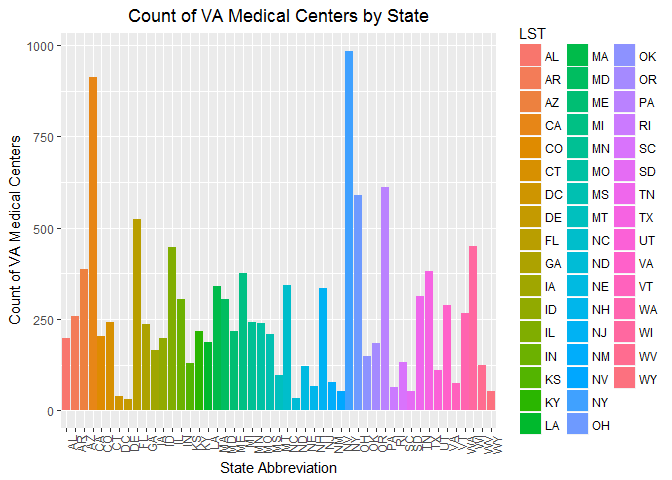
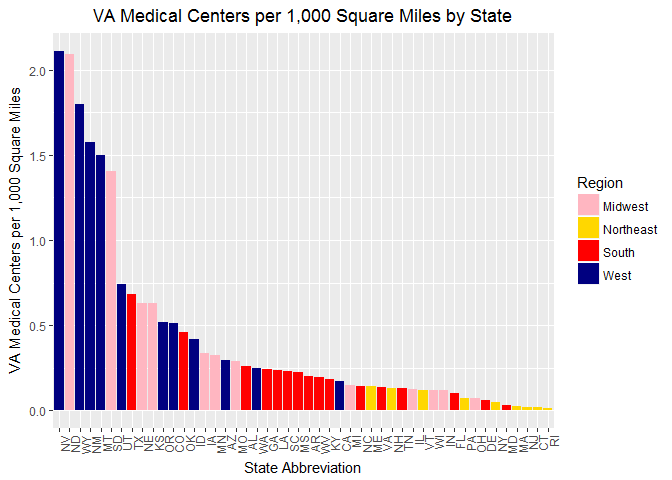

# MSDS 6306 - Assignment 10 - Exploratory Data - VA Study
Brian Coari  
November 5, 2017  


## Introduction

For this assignment our goal is to identify the areas of the country most in need of new Veterans Administration (VA) medical centers in order to determine where to our company should devote its resources and build new VA medical centers. To accomplish this task we will be analyzing data collected in a survey of every known healthcare facility that offers mental health services in the United States in 2015. We obtained these data by going to  https://datafiles.samhsa.gov/study-dataset/national-mental-health-services-survey-2015-n-mhss-2015-ds0001-nid17098 and selecting the "R"" download.

We will first list all the state abbreviations. Then we will list a count of VA medical centers in the mainland United States (omitting Hawaii, Alaska, and US Territories), then we will create a bar chart of that infomation colored by state.

We will then bring in another dataset with information about the states' sizes in square miles so we can find out which states have the highest density of VA medical centers per thousand square miles. We will create another bar chart of this density data listing all states in descending order, colored by region. We will then note any patterns that we see to determine if any region seems high or low in regards to VA medical centers per thousand square miles. 

## VA Study


```r
library('stringr')
```

```
## Warning: package 'stringr' was built under R version 3.4.2
```

```r
library('ggplot2')
```

```
## Warning: package 'ggplot2' was built under R version 3.4.2
```

```r
library('dplyr')
```

```
## Warning: package 'dplyr' was built under R version 3.4.2
```

```
## 
## Attaching package: 'dplyr'
```

```
## The following objects are masked from 'package:stats':
## 
##     filter, lag
```

```
## The following objects are masked from 'package:base':
## 
##     intersect, setdiff, setequal, union
```

```r
# 
# 1. Mental Health Clinics (40%)

# a. This data set is a survey of every known healthcare facility that offers mental health services in the United States in 2015. Navigate to https://datafiles.samhsa.gov/study-dataset/national-mental-health-services-survey-2015-n-mhss-2015-ds0001-nid17098 and select the R download. Look through the codebook PDF for an explanation on certain variables. Upon opening the RDA file, the data set should be inserted into your global environment, which you can then reference.

load(".\\Data\\N-MHSS-2015-DS0001-data\\N-MHSS-2015-DS0001-data-r.rda")

# b. Please create code which lists the State abbreviations without their counts, one abbreviation per State value. It does not have to in data frame format. A vector is fine.

print(unique(mh2015_puf$LST))
```

```
##  [1] AL     AK     AZ     AR     CA     CO     CT     DE     DC     FL    
## [11] GA     HI     ID     IL     IN     IA     KS     KY     LA     ME    
## [21] MD     MA     MI     MN     MS     MO     MT     NE     NV     NH    
## [31] NJ     NM     NY     NC     ND     OH     OK     OR     PA     RI    
## [41] SC     SD     TN     TX     UT     VT     VA     WA     WV     WI    
## [51] WY     AS     GU     PR     VI    
## 55 Levels: AK     AL     AR     AS     AZ     CA     CO     ... WY
```

```r
# c. Filter the data.frame from 1A. We are only interested in the Veterans Administration (VA) medical centers in the mainland United States-create a listing of counts of these centers by state, including only mainland locations. Alaska, Hawaii, and U.S. territories should be omitted. DC, while not a state, is in the mainland, so it should remain included. Convert this to data.frame()

#for convenience, trim white spaces from LST. I can't see any meaningful use for whitespace so I'll do this to the main dataset.
mh2015_puf$LST <- str_trim(mh2015_puf$LST)

#removing Alaska (AK), Hawaii (HI), Guam (GU), American Somoa (AS), Puerto Rico (PR), and the US Virgin Islands (VI)
mh2015_puf_mainland <- mh2015_puf[mh2015_puf$LST != "AK" & mh2015_puf$LST != "HI" &  mh2015_puf$LST != "GU" & mh2015_puf$LST != "AS" & mh2015_puf$LST != "PR" & mh2015_puf$LST != "VI", ]

#I don't actually believe this was necessary since it was already a data frame. I'm not sure what I did wrong before this but I thought I should demonstrate that I know how to do this...
mh2015_puf_mainland_df <- as.data.frame(mh2015_puf_mainland)


# d. Create a ggplot barchart of this filtered data set. Vary the bar's colors by what State it has listed. Give it an appropriately professional title that is centered. Make sure you have informative axis labels. The State axis should be readable, not layered over each other. You're welcome to have a legend or not.

GdpPlot <- ggplot(data=mh2015_puf_mainland_df, aes(x=LST,  fill=LST))
GdpPlot <- GdpPlot + geom_bar() + theme(axis.text.x = element_text(angle = 90, hjust = 1)) 
GdpPlot <- GdpPlot + xlab("State Abbreviation") + ylab("Count of VA Medical Centers") + ggtitle("Count of VA Medical Centers by State")
GdpPlot <- GdpPlot + theme(plot.title = element_text(hjust = 0.5)) 

print(GdpPlot)
```

<!-- -->

```r
# 2. Cleaning and Bringing in New Features (60%)
 
# a. This graph (1D) might be somewhat misleading, as bigger states may have more hospitals, but could be more sparsely located. Read statesize.csv into your R environment. This contains essentially a vector of square miles for each state. In trying to merge it with your data.frame() from 1C, you find that they don't match. Use paste() on your LST column in 1C to see what the matter is, and write what you observe in a comment.

statesize <- read.csv(".\\Data\\statesize.csv",header=TRUE, sep=",")

paste(statesize$Abbrev)
```

```
##  [1] "AL" "AK" "AZ" "AR" "CA" "CO" "CT" "DE" "FL" "GA" "HI" "ID" "IL" "IN"
## [15] "IA" "KS" "KY" "LA" "ME" "MD" "MA" "MI" "MN" "MS" "MO" "MT" "NE" "NV"
## [29] "NH" "NJ" "NM" "NY" "NC" "ND" "OH" "OK" "OR" "PA" "RI" "SC" "SD" "TN"
## [43] "TX" "UT" "VT" "VA" "WA" "WV" "WI" "WY"
```

```r
paste(unique(mh2015_puf_mainland_df$LST))
```

```
##  [1] "AL" "AZ" "AR" "CA" "CO" "CT" "DE" "DC" "FL" "GA" "ID" "IL" "IN" "IA"
## [15] "KS" "KY" "LA" "ME" "MD" "MA" "MI" "MN" "MS" "MO" "MT" "NE" "NV" "NH"
## [29] "NJ" "NM" "NY" "NC" "ND" "OH" "OK" "OR" "PA" "RI" "SC" "SD" "TN" "TX"
## [43] "UT" "VT" "VA" "WA" "WV" "WI" "WY"
```

```r
# I observe no difference other than the fact that DC is not present in statesize. I am guessing this is referring to the spaces at the end of LST that I omitted previously in data cleanup, so I am proceeding with the assignment since there's no point in fixing it again. See above :).


# b. Correct the problem with the LST column using any method in R that is programmatic and easily understandable. Once you have made these state abbreviations identical to statesize.csv's Abbrev column, merge the data.frame() from 1C and statesize.csv in order to add size information.

#We will merge the data for statesize, but we will lose DC VA medical center data in the merge since there is no statesize information for DC
#We COULD keep DC in the final dataset but that would make some of the analytics we plan to do problematic, and the default behavior of the merge function is to omit it
va_data_with_statesize = merge(statesize, mh2015_puf_mainland_df, by.x = "Abbrev", by.y = "LST")

# c. Calculate a new variable in your combined data.frame() which indicates the VA hospitals per thousand square miles.

#I'm sure there are many good ways there are to do this but not working with a grouped table was getting difficult, so I'm creating a grouped table of counts of hospitals by region.
va_data_with_statesize_group <- group_by(va_data_with_statesize, Abbrev, Region, SqMiles)
va_data_with_statesize_count  <- summarise(va_data_with_statesize_group,count = n())
va_data_with_statesize_count$countPerThousandSqMiles = (va_data_with_statesize_count$SqMiles/1000)/va_data_with_statesize_count$count

# d. Create another ggplot which considers the VAs per square thousand miles, rather than just frequency.
# . Make sure the State axis is readable, like before. Change the title and axes as appropriate.
# . Modify the ggplot syntax to make your bars in descending order (there are StackOverflow topics for this, and I have demonstrated how in Live Coding in prior classes).
# . Color-code the bars based on Region (see the merged data.frame)-however, change the color scheme from the default. Any set of colors is fine, so long as it is readable.
# . Keep the legend-you should have four regions and therefore four colors.

Custom_colors <- c("#ffb6c1", "#ffd700", "#ff0000", "#000080")

GdpPlot <- ggplot(data=va_data_with_statesize_count, aes(x=reorder(Abbrev, -countPerThousandSqMiles), y=countPerThousandSqMiles, fill=Region))
GdpPlot <- GdpPlot + geom_bar(stat = "identity") + scale_y_continuous() + theme(axis.text.x = element_text(angle = 90, hjust = 1)) 
GdpPlot <- GdpPlot + xlab("State Abbreviation") + ylab("VA Medical Centers per 1,000 Square Miles") + ggtitle("VA Medical Centers per 1,000 Square Miles by State")
GdpPlot <- GdpPlot + theme(plot.title = element_text(hjust = 0.5)) + scale_fill_manual(values=Custom_colors)

print(GdpPlot)
```

<!-- -->

```r
# e. What patterns do you see? By this metric, is there any region that seems relatively high for VA medical centers per thousand square miles? How about low? Given these data, what advice might you give your boss before you start modeling (and why)?
```

## Conclusion

From our analysis we can conclude that states in the Midwest and West regions appear to have the highest concentration of VA medical centers, while states in the South and the Northeast have fewer VA Medical Centers. However, the states in the Northeast appear to have the fewest VA medical centers per 1,000 square miles of land, so it seems like states in the Northeast would be a good region on which to focus if we intend to build new VA medical centers. However I would also advise my boss that we should be comparing these data with some observations of the concentrations of veterans living in these areas, since if there are very few veterens living in the Northeast region then builing more VA medical centers there would be a waste of resources. 
